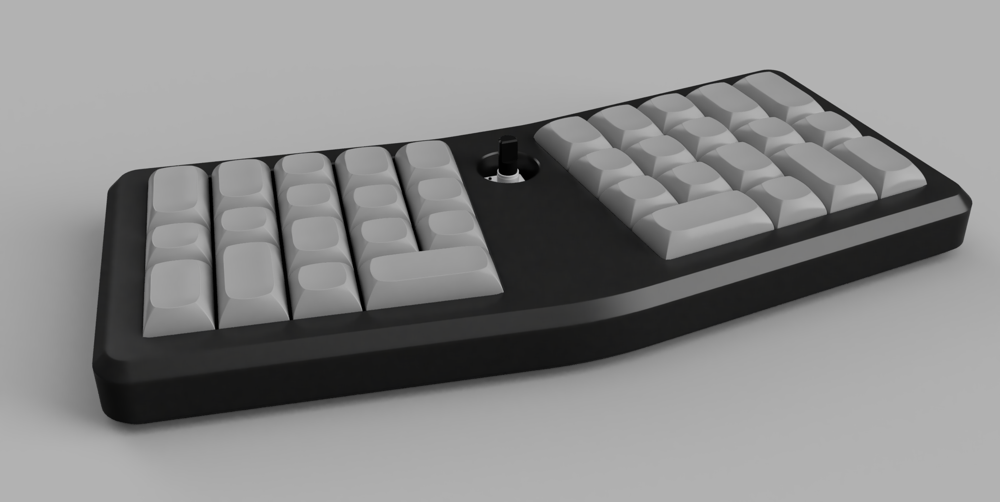

# Mon Boitier

A 0º case for the [Le Bruce PCB](https://www.jlw-kb.com/products/bruce-le-clavier-le-pcb) inspired by [SineScire/LeChiffreCase](https://github.com/SineScire/LeChiffreCase). Designed to be easily CNC milled on a 3 axis machine.

Uses M2 screws and heat set inserts.