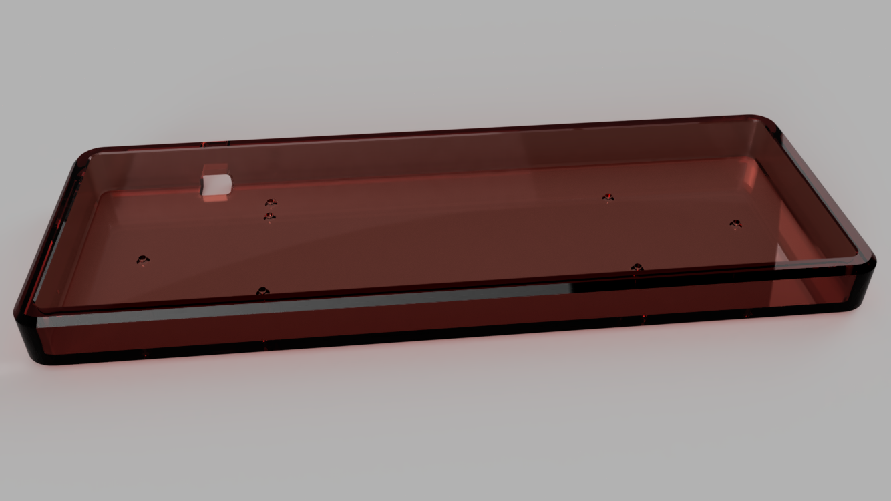

# Planck High Profile Case

I based the measurements off of [OLKB's original design](https://github.com/olkb/olkb_parts/blob/master/planck/hi-pro-bottom.stl). It's a little chunkier to allow it to be machined from acrylic.